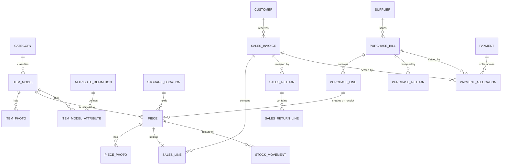
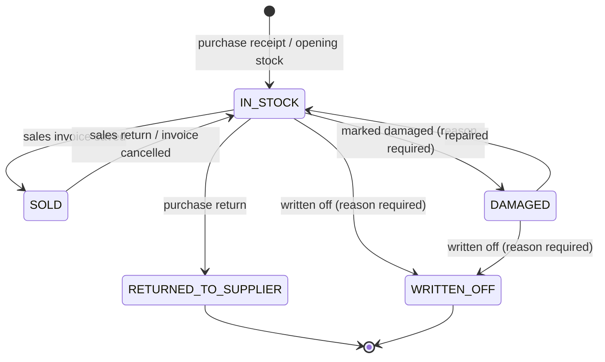

# Data Model
## PieceTrack

Companion to `01-requirements.md`. Version 1.0, 15 August 2026. *Attribute tables added M15.*

---

## 1. The idea the model is built around

The shop does not hold "4 chairs" or "4 rings". It holds four specific units, each of which arrived on a particular bill, cost a particular amount, sits in a particular place, and will be sold to a particular customer on a particular day.

So **`piece` is the centre of this model**, not `item_model`. Every other table either describes a piece, brings pieces in, sends pieces out, or records money moving because of pieces.

Three consequences follow, and they explain most of the design decisions below:

1. **Cost is per piece, not per model.** Two identical sofas bought six months apart have different landed costs. Profit is computed from the cost of the exact piece sold, so it is real rather than averaged.
2. **Quantity is always 1 in storage.** A sale of six chairs is six invoice lines, one per piece. The invoice *PDF* groups them back into "6 × Dining Chair" for the customer's benefit, but the database never loses which six.
3. **Stock levels are never stored as counters.** "How many are in stock" is always a `COUNT` over pieces in state `IN_STOCK`. Stored counters drift; a piece register cannot.

---

## 2. Entity relationship overview



---

## 3. The piece lifecycle

This state machine is the heart of the system. Every stock question — what is available, what was sold, what is written off — is answered by it.



Rules the code must enforce (FR-PIECE-04):

- Only the transitions drawn above are legal. Everything else is rejected with a message naming the piece and its current state.
- Only `IN_STOCK` pieces can be added to an invoice. The billing search filters on state, so a sold piece is never even offered.
- Every transition writes a `stock_movement` row in the same transaction as the state change. The two cannot diverge.
- `RETURNED_TO_SUPPLIER` and `WRITTEN_OFF` are terminal. The row is kept forever — it is history, and it is what makes the audit trail worth having.

---

## 4. Tables

Conventions used throughout:

- Primary keys are `INTEGER PRIMARY KEY AUTOINCREMENT`, named `id`.
- **Money is stored as `INTEGER` paisa** and mapped to `BigDecimal` in Java through a single JPA `AttributeConverter`. SQLite's dynamic typing makes a `DECIMAL` column a false promise, and floating point must never touch money (NFR-13). One converter, applied everywhere, removes the whole class of rounding bugs.
- Dates are `TEXT` in ISO-8601: `YYYY-MM-DD` for dates, `YYYY-MM-DDTHH:MM:SS±HH:MM` for timestamps. They sort and compare correctly as text.
- `created_at` / `updated_at` on every business table.
- Booleans are `INTEGER` 0/1.

### 4.1 Configuration and access

**`shop_profile`** — exactly one row, `id = 1`, enforced by a check constraint.

| Column | Type | Notes |
|---|---|---|
| id | INTEGER PK | always 1 |
| shop_name | TEXT NOT NULL | |
| address_line1, address_line2, city, pincode | TEXT | |
| state_name | TEXT NOT NULL | |
| state_code | TEXT NOT NULL | 2-digit GST state code — decides CGST/SGST vs IGST |
| gstin | TEXT | 15 chars |
| registration_type | TEXT NOT NULL | `REGULAR` / `COMPOSITION` — see open point §7.1 of the SRS |
| phone, email | TEXT | |
| logo_path | TEXT | relative to the data folder |
| invoice_declaration, signature_text | TEXT | printed on the PDF |

**`app_user`**

| Column | Type | Notes |
|---|---|---|
| id | INTEGER PK | |
| username | TEXT NOT NULL UNIQUE | |
| password_hash | TEXT NOT NULL | Argon2id / bcrypt — never the password itself |
| recovery_code_hash | TEXT | hash of the one-time recovery code (SRS §7.3) |
| role | TEXT NOT NULL | `OWNER` in v1; the column exists so staff roles need no migration later |
| is_active | INTEGER NOT NULL | |
| last_login_at | TEXT | |

**`app_setting`** — key/value, one row per setting from FR-SYS-02: `key` TEXT PK, `value` TEXT, `updated_at` TEXT. Kept generic on purpose; settings change more often than schemas should.

**`license`** *(added M14)* — exactly one row, `id = 1`, mirroring `shop_profile`'s singleton shape. Holds this installation's activation binding and most recently issued signed lease (FR-LIC-01...06).

| Column | Type | Notes |
|---|---|---|
| id | INTEGER PK | always 1 |
| license_id | TEXT | server-assigned id; NULL until first successful activation |
| activation_key | TEXT NOT NULL | the key typed into the wizard |
| shop_name | TEXT | as recorded by the licence server; display only |
| fingerprint | TEXT NOT NULL | SHA-256 of the Windows `MachineGuid` this key was bound to |
| volume_serial | TEXT | soft signal only, never enforced — see below |
| lease_token | TEXT | the raw signed lease as received; re-verified fresh on every read, never trusted from storage |
| lease_expires_at | TEXT | cached copy of the verified lease's expiry, for display |
| last_contact_at, last_contact_result | TEXT | when the server was last reached, and what it said |
| clock_watermark | TEXT NOT NULL | the highest instant this installation has ever observed |
| activated_at | TEXT NOT NULL | |

Unlike the Google/OneDrive refresh tokens (FR-BAK-08), the lease is stored **unencrypted** — deliberately. It is tamper-evident by its own Ed25519 signature already (`LicenseVerifier` re-verifies it on every read, never trusting the row directly), so DPAPI protection would add nothing beyond a new failure mode: a Windows profile change would destroy an otherwise perfectly valid lease. Nothing in this table is a secret the way a refresh token is; the one thing that must never exist on this machine at all is the signing *private* key.

`fingerprint` is bound only to the `MachineGuid` component of the machine fingerprint — the stable one, set once at OS install and unaffected by a disk swap or hardware repair. `volume_serial` is recorded purely as an informational signal for the licence owner ("hardware changed") and is never itself grounds for wind-down, since a routine reformat would otherwise cost a legitimate shop its licence. `clock_watermark` exists to catch a deliberately rolled-back system clock trying to keep an expired lease looking current: if "now" is ever more than 48 hours behind the highest instant this row has ever recorded, the licence treats that as tampering rather than as a plausible clock drift (DST, a dead CMOS battery).

**`sequence_counter`** — the source of gap-free numbering (FR-SAL-07).

| Column | Type | Notes |
|---|---|---|
| name | TEXT | `INVOICE`, `PIECE_TAG:<model code>`, `CREDIT_NOTE`, `DEBIT_NOTE` |
| scope | TEXT | financial year `26-27`, or `''` where the counter never resets |
| next_value | INTEGER NOT NULL | |
| | | PK (name, scope) |

Allocation happens inside the same transaction that saves the document, by updating this row. That is what makes numbers consecutive with no gaps, and it is why a number is never allocated to a screen the owner might abandon.

### 4.2 Catalogue

**`category`** — `id`, `name` UNIQUE, `is_active`. Seeded by V2 with furniture-flavoured examples (Sofa, Bed, Dining, Wardrobe, Chair, Table, Mattress, Other); as of V12 (M15) those seed rows are deleted on any install where none of them is actually referenced by an `item_model`, so a fresh install now starts with an empty, owner-defined list. A live shop that already uses one of them keeps it untouched — the delete is conditional on being unreferenced, not unconditional.

**`storage_location`** — `id`, `name` UNIQUE, `is_active`. Seeded by V2 with furniture-flavoured examples (Showroom Floor, Display Window, Godown, Workshop); cleaned up by V12 the same way and for the same reason as `category` above, checked against `piece.location_id` and `stock_movement.from_location_id`/`to_location_id`.

**`item_model`**

| Column | Type | Notes |
|---|---|---|
| id | INTEGER PK | |
| model_code | TEXT NOT NULL UNIQUE | tag prefix, e.g. `SOF` |
| model_name | TEXT NOT NULL | |
| category_id | INTEGER FK NOT NULL | |
| hsn_code | TEXT NOT NULL | |
| gst_rate | NUMERIC NOT NULL | percent; per model, never hard-coded |
| length_cm, width_cm, height_cm, material, finish, colour | NUMERIC / TEXT | **Dead as of V12 (M15).** Not dropped — SQLite cannot drop a column without rebuilding a foreign-key-referenced table, the same reasoning V9/V10 already established — but `ItemModelRepository` no longer reads or writes any of the six. Replaced by `attribute_definition` / `item_model_attribute` below; any non-null value a live shop already had was backfilled into the new tables by V12 before the columns went dead. |
| default_sale_price | INTEGER | paisa |
| is_active | INTEGER NOT NULL | discontinued models set this to 0 — models are never deleted |
| notes | TEXT | |

**`item_photo`** — `id`, `item_model_id` FK, `relative_path` TEXT (under `Photos/`), `sort_order`, `is_primary`.

Photos are files on disk with a path in the database, not blobs. This keeps the database small and fast — and it is precisely why the backup archive must include the `Photos/` folder (FR-BAK-03). A database-only backup would restore rows pointing at files that no longer exist.

**`attribute_definition`** *(added V12, M15)* — the owner's own product field list, replacing the fixed dimension/material/finish/colour columns above.

| Column | Type | Notes |
|---|---|---|
| id | INTEGER PK | |
| name | TEXT NOT NULL UNIQUE | e.g. "Material", "Warranty", "Voltage", "Carat" |
| display_order | INTEGER NOT NULL DEFAULT 0 | order fields render in on the item model editor |
| is_active | INTEGER NOT NULL DEFAULT 1 | deactivated definitions stop appearing on the editor but their existing values are kept |

**`item_model_attribute`** *(added V12, M15)* — the values, one row per (model, definition) pair.

| Column | Type | Notes |
|---|---|---|
| item_model_id | INTEGER FK NOT NULL | |
| attribute_definition_id | INTEGER FK NOT NULL | keyed by definition **id**, not name, so renaming a definition never orphans its values |
| value | TEXT | |
| | | PK (item_model_id, attribute_definition_id) |

Saving a model's attribute values is a full delete-and-reinsert of its rows in this table — the same replace-the-whole-set pattern `ItemModelRepository.update()` already uses for the model row itself — driven by a single "Save" button that submits the whole form at once. A blank value is dropped rather than stored as an empty string.

### 4.3 The piece register

**`piece`** — the most important table in the system.

| Column | Type | Notes |
|---|---|---|
| id | INTEGER PK | |
| tag | TEXT NOT NULL UNIQUE | `SOF-0042`; what is physically written on the furniture |
| item_model_id | INTEGER FK NOT NULL | |
| source_type | TEXT NOT NULL | `PURCHASE` / `OPENING_STOCK` |
| purchase_line_id | INTEGER FK NULL | null for opening stock |
| landed_cost | INTEGER NOT NULL | paisa; **immutable after receipt** (FR-PIECE-05) |
| location_id | INTEGER FK | current physical location |
| state | TEXT NOT NULL | `IN_STOCK` / `SOLD` / `RETURNED_TO_SUPPLIER` / `DAMAGED` / `WRITTEN_OFF` |
| state_reason | TEXT | required for DAMAGED and WRITTEN_OFF |
| acquired_on | TEXT NOT NULL | drives stock aging (FR-RPT-02) |
| created_at, updated_at | TEXT | |

`state` on this row is the authoritative *current* state; `stock_movement` is its *history*. Both are written in one transaction, so they can never disagree.

**`stock_movement`** — append-only. No updates, no deletes, ever.

| Column | Type | Notes |
|---|---|---|
| id | INTEGER PK | |
| piece_id | INTEGER FK NOT NULL | |
| movement_type | TEXT NOT NULL | `RECEIPT`, `OPENING`, `SALE`, `SALES_RETURN`, `INVOICE_CANCELLED`, `PURCHASE_RETURN`, `DAMAGE`, `REPAIR`, `WRITE_OFF`, `LOCATION_CHANGE` |
| from_state, to_state | TEXT | null on the first row |
| from_location_id, to_location_id | INTEGER FK | for location changes |
| ref_type, ref_id | TEXT / INTEGER | the document that caused it — invoice, bill, return |
| moved_at | TEXT NOT NULL | |
| note | TEXT | |

Why an append-only ledger alongside a current-state column: the state column answers "what is true now" in one indexed read, and the ledger answers "how did it get that way" without which no stock discrepancy can ever be investigated. Losing either one costs more than storing both.

**`piece_photo`** — `id`, `piece_id` FK, `relative_path` TEXT (under `Photos/pieces/`), `sort_order`, `is_primary`. Same shape as `item_photo` (§4.2), one level down: a piece's actual physical condition can differ from its siblings even though they share a model, so its photos are captured against the piece, not the model. Stored under `Photos/pieces/<piece id>/` rather than `Photos/<piece id>/` — the item-model convention is a bare numeric folder directly under `Photos/`, and a piece id can coincidentally equal an item model id, so the extra `pieces/` segment keeps the two namespaces from colliding.

### 4.4 Purchasing

**`supplier`** — `id`, `name` NOT NULL, `gstin`, `address_line1/2`, `city`, `pincode`, `state_name`, `state_code` NOT NULL, `phone`, `email`, `contact_person`, `opening_balance` (paisa), `is_active`, `notes`.

**`purchase_bill`**

| Column | Type | Notes |
|---|---|---|
| id | INTEGER PK | |
| supplier_id | INTEGER FK NOT NULL | |
| supplier_bill_no | TEXT NOT NULL | their number, not ours |
| bill_date, received_date | TEXT NOT NULL | |
| is_interstate | INTEGER NOT NULL | derived from state codes at entry, then frozen |
| taxable_value, freight, loading_charges, other_charges | INTEGER | paisa |
| cgst_amount, sgst_amount, igst_amount, round_off, grand_total | INTEGER | paisa |
| status | TEXT NOT NULL | `DRAFT` / `RECEIVED` / `REVERSED` |
| notes | TEXT | |
| | | UNIQUE (supplier_id, supplier_bill_no) — the same bill cannot be entered twice |

**`purchase_line`** — `id`, `purchase_bill_id` FK, `item_model_id` FK, `quantity` INTEGER, `rate`, `discount_amount`, `taxable_value`, `gst_rate`, `cgst_amount`, `sgst_amount`, `igst_amount`, `line_total`.

Confirming receipt creates `quantity` rows in `piece` per line (FR-PUR-05).

**Landed cost apportionment** (FR-PUR-06), the exact arithmetic:

```
line_unit_cost   = (line.taxable_value) / line.quantity
charge_pool      = bill.freight + bill.loading + bill.other_charges
line_charge      = charge_pool × (line.taxable_value / bill.taxable_value)
piece_cost       = line_unit_cost + (line_charge / line.quantity)
```

All arithmetic in paisa. Any remainder from integer division is added to the **last** piece of the line, so `SUM(piece.landed_cost)` over a bill equals `bill.taxable_value + charge_pool` exactly, with no drifting paisa. GST is excluded from cost because input tax is credit, not cost — subject to SRS §7.4.

**`purchase_return`** — `id`, `purchase_bill_id` FK, `debit_note_no`, `return_date`, `reason`, tax and total columns, `pdf_path`.
**`purchase_return_line`** — `id`, `purchase_return_id` FK, `piece_id` FK UNIQUE, value columns. One row per returned piece.

### 4.5 Sales

**`customer`** — `id`, `name` NOT NULL, `phone` NOT NULL (indexed; drives the WhatsApp share and the "known customer" lookup), `address_line1/2`, `city`, `pincode`, `state_name`, `state_code`, `gstin` (null for unregistered buyers, which is most retail), `notes`, `created_at`.

**`sales_invoice`**

| Column | Type | Notes |
|---|---|---|
| id | INTEGER PK | |
| invoice_no | TEXT NOT NULL UNIQUE | `INV/26-27/0001` |
| financial_year | TEXT NOT NULL | `26-27` |
| invoice_date | TEXT NOT NULL | |
| customer_id | INTEGER FK NOT NULL | |
| place_of_supply_state_code | TEXT NOT NULL | |
| is_interstate | INTEGER NOT NULL | frozen at save |
| is_price_inclusive | INTEGER NOT NULL | whether entered prices included tax |
| gross_value, line_discount_total, bill_discount, taxable_value | INTEGER | paisa |
| cgst_amount, sgst_amount, igst_amount | INTEGER | paisa |
| round_off, grand_total | INTEGER | paisa |
| status | TEXT NOT NULL | `ACTIVE` / `CANCELLED` |
| cancelled_at, cancel_reason | TEXT | |
| pdf_path | TEXT | relative to the data folder |
| notes | TEXT | |

**`sales_line`** — one row per piece sold.

| Column | Type | Notes |
|---|---|---|
| id | INTEGER PK | |
| sales_invoice_id | INTEGER FK NOT NULL | |
| piece_id | INTEGER FK NOT NULL UNIQUE | **UNIQUE across the table** — a piece can appear on exactly one active invoice line, enforced by the database, not just by code |
| item_model_id | INTEGER FK NOT NULL | |
| description_snapshot, hsn_snapshot | TEXT NOT NULL | frozen at sale, so a later catalogue edit never changes a past invoice |
| gst_rate | NUMERIC NOT NULL | frozen at sale |
| unit_price, discount_amount, taxable_value | INTEGER | paisa |
| cgst_amount, sgst_amount, igst_amount, line_total | INTEGER | paisa |
| **cost_at_sale** | INTEGER NOT NULL | copy of `piece.landed_cost` at the moment of sale — this is what makes profit permanently correct (FR-SAL-09) |
| delivered_at | TEXT | *(added V10, M13)* NULL until this piece has physically reached the customer (FR-SAL-13); NULL means not yet delivered, not "unknown" — no backfill was needed since that is exactly the right value for every pre-M13 row |

*The snapshot columns are not redundancy for its own sake.* An invoice is a legal document; what it said on the day it was issued must never change because someone later renamed a product or corrected a rate.

**"Booking" is a view, not a table.** A booking is simply an `ACTIVE` invoice looked at by how many of its lines have `delivered_at` set — Pending (none), Partly delivered (some), or Delivered (all) — computed at read time by `BookingRepository`, the same way customer/supplier balances are computed rather than stored. A line already credited back via `sales_return_line` is excluded from both the delivered and total counts for its invoice, so a partial return can never leave a booking stuck short of Delivered.

**Presentation grouping:** six identical chairs are six rows here but must not print as six identical lines. The PDF groups lines by (model, unit price, gst rate) and shows a quantity, listing piece tags underneath only if the owner enables that in settings.

**`sales_return`** — `id`, `sales_invoice_id` FK, `credit_note_no` UNIQUE, `return_date`, `reason`, tax and total columns, `refund_mode` (`ADJUST_AGAINST_DUE` / `CASH_REFUND`), `pdf_path`.
**`sales_return_line`** — `id`, `sales_return_id` FK, `piece_id` FK, `sales_line_id` FK, value columns.

### 4.6 Money

**`payment`**

| Column | Type | Notes |
|---|---|---|
| id | INTEGER PK | |
| direction | TEXT NOT NULL | `IN` (from customer) / `OUT` (to supplier) |
| party_type, party_id | TEXT / INTEGER | `CUSTOMER` or `SUPPLIER` |
| payment_date | TEXT NOT NULL | |
| amount | INTEGER NOT NULL | paisa |
| mode | TEXT NOT NULL | `CASH` / `UPI` / `CARD` / `BANK_TRANSFER` / `CHEQUE` |
| reference_no, note | TEXT | UPI reference, cheque number |
| is_deleted, deleted_reason, deleted_at | INTEGER / TEXT | soft delete — a payment is never silently removed (FR-PAY-06) |

**`payment_allocation`** — `id`, `payment_id` FK, `target_type` (`SALES_INVOICE` / `PURCHASE_BILL`), `target_id`, `amount` (paisa).

Allocation is a separate table even though v1 mostly settles one invoice per payment: it costs nothing now and it is the difference between "customer paid ₹20,000 across three bills" being expressible or not.

**Balances are computed, never stored:**

```
invoice_balance  = grand_total
                 − SUM(allocations to it from non-deleted payments)
                 − SUM(credit notes against it)

supplier_balance = supplier.opening_balance
                 + SUM(grand_total of RECEIVED bills)
                 − SUM(debit notes)
                 − SUM(allocations to those bills)
```

A stored balance column would need updating from six different code paths and would be wrong within a month. At this data volume, computing it is free.

### 4.7 Operations

**`audit_log`** — `id`, `logged_at`, `user_id`, `action`, `entity_type`, `entity_id`, `before_json`, `after_json`, `note`. Append-only, no UI to edit it (FR-SYS-03).

**`backup_history`**

| Column | Type | Notes |
|---|---|---|
| id | INTEGER PK | |
| backup_type | TEXT NOT NULL | `DAILY` / `WEEKLY` / `MANUAL` |
| started_at, finished_at | TEXT | |
| status | TEXT NOT NULL | `SUCCESS` / `FAILED` / `UPLOAD_PENDING` |
| archive_name | TEXT | `piecetrack-20260815-213000-daily.zip.enc` *(prefix was `fims-` before M15; restore reads the stored `archive_name` value directly, so pre-rename archives still resolve)* |
| size_bytes | INTEGER | |
| sha256 | TEXT | of the plaintext archive, for restore verification |
| remote_file_id | TEXT | *(renamed from `drive_file_id` in V9, M12)* the Drive file id or Graph item id this archive was uploaded to; used for retention pruning and restore |
| provider | TEXT | *(added V9, M12)* `GOOGLE_DRIVE` / `ONEDRIVE` — which cloud destination `remote_file_id` actually belongs to. NULL when no remote copy exists. No `CHECK` constraint, deliberately: SQLite cannot drop one later without a table rebuild, and a third provider one day should not require that. |
| local_path | TEXT | last 3 kept locally (FR-BAK-16) |
| error_message | TEXT | |

`UPLOAD_PENDING` is what makes FR-BAK-12 work: the archive exists and is encrypted, the upload simply has not happened yet, and the scheduler retries it when connectivity returns.

`provider` matters because the owner can switch the active backup destination (FR-BAK-17) after archives already exist under the previous one — `remote_file_id` alone would be ambiguous about which API to call for restore or pruning. `CloudProviders.byId(row.provider())` (falling back to Google Drive for a NULL, pre-M12 row) is what resolves the right one.

---

## 5. Indexes

Chosen from the queries the screens actually run, not speculatively:

| Table | Index | Serves |
|---|---|---|
| piece | (state, item_model_id) | billing search, stock counts — the hottest query in the system |
| piece | (tag) UNIQUE | tag lookup |
| piece | (location_id, state) | stock by location |
| piece | (acquired_on) | stock aging buckets |
| sales_invoice | (invoice_date), (status), (customer_id) | period reports, dues |
| sales_line | (sales_invoice_id), (piece_id) UNIQUE | invoice load, double-sale prevention |
| payment_allocation | (target_type, target_id) | balance computation |
| purchase_bill | (supplier_id, bill_date) | supplier ledger |
| stock_movement | (piece_id, moved_at) | piece history |
| customer | (phone) | known-customer lookup at billing |
| piece_photo | (piece_id) | piece detail photo lookup — a deliberate departure from `item_photo`, which has no index: piece cardinality is bounded by NFR-04's 20,000-piece target, two orders of magnitude past item-model cardinality |

---

## 6. Files on disk

The database is only part of the data. Under `%LOCALAPPDATA%\PieceTrack\` *(renamed from `FurnitureIMS`, M15 — an existing install's folder is migrated automatically, not left behind)*:

```
data/app.db              SQLite database
data/app.db-wal          write-ahead log
Photos/<model id>/*.jpg  item photos referenced by item_photo.relative_path
Photos/pieces/<piece id>/*.jpg  piece condition photos referenced by piece_photo.relative_path
Invoices/<FY>/*.pdf      generated invoice, credit note and debit note PDFs
Backups/                 last 3 encrypted archives kept locally
logs/                    rolling application logs, 30 days
config/                  OAuth refresh token, DPAPI-encrypted
```

**Everything in `data/`, `Photos/` and `Invoices/` is inside the backup archive.** `logs/` and `config/` are not — logs are not business data, and the OAuth token is machine-bound and must be re-authorised on a new PC anyway.

---

## 7. Schema versioning

Flyway migrations under `db/migration`, named `V1__initial_schema.sql`, `V2__…`, forward-only, run automatically at startup (NFR-08). The current schema version is written into every backup manifest, which is what lets FR-BAK-15 refuse to restore an archive newer than the running application, and migrate one that is older.

Before any migration runs, the application takes a local backup automatically (NFR-09). A failed migration on a shop's only copy of its own data is the worst outcome this system can produce; it is cheap to make it impossible.
